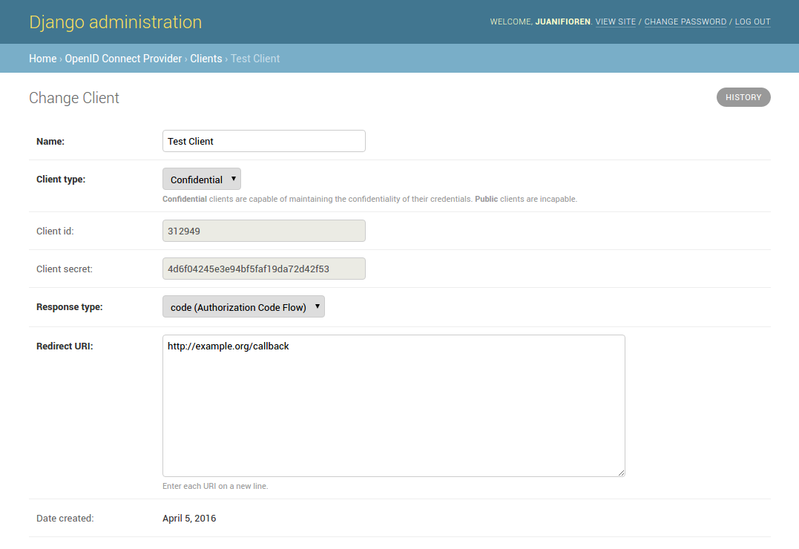

.. _relyingparties:

Relying Parties
###############

Relying Parties (RP) creation is up to you. This is because is out of the scope in the core implementation of OIDC.
So, there are different ways to create your Clients (RP). By displaying a HTML form or maybe if you have internal trusted Clients you can create them programatically.
Out of the box, django-oidc-provider enables you to create them by hand in the django admin.

OAuth defines two client types, based on their ability to maintain the confidentiality of their client credentials:

* ``confidential``: Clients capable of maintaining the confidentiality of their credentials (e.g., client implemented on a secure server with restricted access to the client credentials).
* ``public``: Clients incapable of maintaining the confidentiality of their credentials (e.g., clients executing on the device used by the resource owner, such as an installed native application or a web browser-based application), and incapable of secure client authentication via any other means.

Properties
==========

* ``name``: Human-readable name for your client.
* ``client_type``: Values are ``confidential`` and ``public``.
* ``client_id``: Client unique identifier.
* ``client_secret``: Client secret for confidential applications.
* ``response_type``: Values depends of wich flow you want use.
* ``jwt_alg``: Clients can choose wich algorithm will be used to sign id_tokens. Values are ``HS256`` and ``RS256``.
* ``date_created``: Date automatically added when created.
* ``redirect_uris``: List of redirect URIs.
* ``require_consent``: If checked, the Server will never ask for consent (only applies to confidential clients).
* ``reuse_consent``: If enabled, the Server will save the user consent given to a specific client, so that user won't be prompted for the same authorization multiple times.

Optional information:

* ``website_url``: Website URL of your client.
* ``terms_url``: External reference to the privacy policy of the client.
* ``contact_email``: Contact email.
* ``logo``: Logo image.

Using the admin
===============

We suggest you to use Django admin to easily manage your clients:

For re-generating ``client_secret``, when you are in the Client editing view, select "Client type" to be ``public``. Then after saving, select back to be ``confidential`` and save again.

Custom view
===========

If for some reason you need to create your own view to manage them, you can grab the form class that the admin makes use of. Located in ``oidc_provider.admin.ClientForm``.

Some built-in logic that comes with it:

* Automatic ``client_id`` and ``client_secret`` generation.
* Empty ``client_secret`` when ``client_type`` is equal to ``public``.

Programmatically
================

You can create a Client programmatically with Django shell ``python manage.py shell``::

    >>> from oidc_provider.models import Client
    >>> c = Client(name='Some Client', client_id='123', client_secret='456', response_type='code', redirect_uris=['http://example.com/'])
    >>> c.save()

`Read more about client creation in the OAuth2 spec <http://tools.ietf.org/html/rfc6749#section-2>`_
